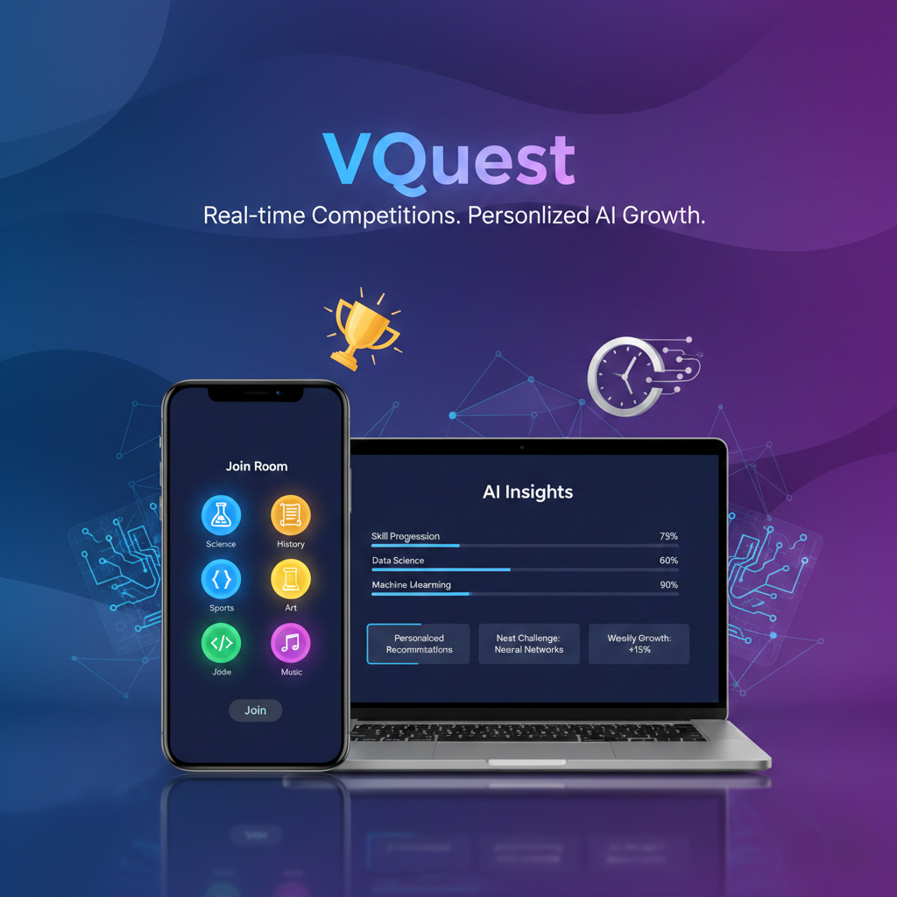

# VQUEST

---

## Proje Hakkında
TEST KOMUTU = echo -e "\n\n🚀 1. Ömer'in Testleri Başlıyor..." && (cd backend && node omer_test.js) ; sleep 0.5 ; echo -e "\n\n🚀 2. Sedat'ın Testleri Başlıyor..." && (cd backend && node Sedat_Bakla_Test.js) ; sleep 0.5 ; echo -e "\n\n🚀 3. Emir'in Testleri Başlıyor..." && node Sahsi-Dosyalar/Emir-Omrak/Emir-Omrak-Test.js ; sleep 0.5 ; echo -e "\n\n🚀 4. Şahin'in Testleri Başlıyor..." && node Sahsi-Dosyalar/Sahin-Kavsara/Sahin-Kavsara-Test.js ; sleep 0.5 ; echo -e "\n\n🚀 5. Mustafa'nın Testleri Başlıyor..." && node Sahsi-Dosyalar/Mustafa-İsmail-Toptaş/Mustafa-Ismail-Toptas-Test.js

**Proje Tanımı:** VQuest, kullanıcıların farklı soru kategorilerinde çevrimiçi odalara katılarak eşzamanlı yarıştığı ve yapay zeka destekli kişisel performans analizi sunan kapsamlı bir bilgi yarışması platformudur. Gelişmiş altyapımız sayesinde kullanıcılara rekabetçi ve kesintisiz bir oyun deneyimi sunarken, dinamik soru havuzumuz ve kendi özel soru paketlerini oluşturma imkanı ile sistemi tamamen kişiselleştirilebilir kılıyoruz. VQuest olarak sıradan bir test uygulamasının ötesine geçerek; canlı puan tabloları, zaman kısıtlı rekabet ve oyun sonrası oluşturulan yapay zeka destekli gelişim raporlarıyla hem eğlendiren hem de kullanıcıların zayıf ve güçlü yönlerini keşfetmelerini sağlayan öğretici bir ekosistem yaratmayı hedefliyoruz.

**Proje Kategorisi:** Eğitim Teknolojileri (EdTech) & Gerçek Zamanlı Çok Oyunculu Bilgi Yarışması

**Referans Uygulama:**  [Kahoot!](https://kahoot.com/)

---

## Proje Linkleri

- **REST API Adresi:** https://vquest-backend-api.onrender.com
- **Web Frontend Adresi:** https://v-quest-frontend-deploy.vercel.app/

---

## Proje Ekibi

**Grup Adı:** VDevs

**Ekip Üyeleri:**
- Şahin Kavsara
- Mustafa İsmail Toptaş
- Emir Omrak
- Sedat Bakla
- Ömer Said Karakuş

---

## Dokümantasyon

Proje dokümantasyonuna aşağıdaki linklerden erişebilirsiniz:

1. [Gereksinim Analizi](MD-Dosyalari/Gereksinim-Analizi.md)
2. [REST API Tasarımı](MD-Dosyalari/API-Tasarimi.md)
3. [REST API](MD-Dosyalari/Rest-API.md)
4. [Web Front-End](MD-Dosyalari/WebFrontEnd.md)
5. [Mobil Front-End](MD-Dosyalari/MobilFrontEnd.md)
6. [Mobil Backend](MD-Dosyalari/MobilBackEnd.md)
7. [Video Sunum](MD-Dosyalari/Sunum.md)

---
